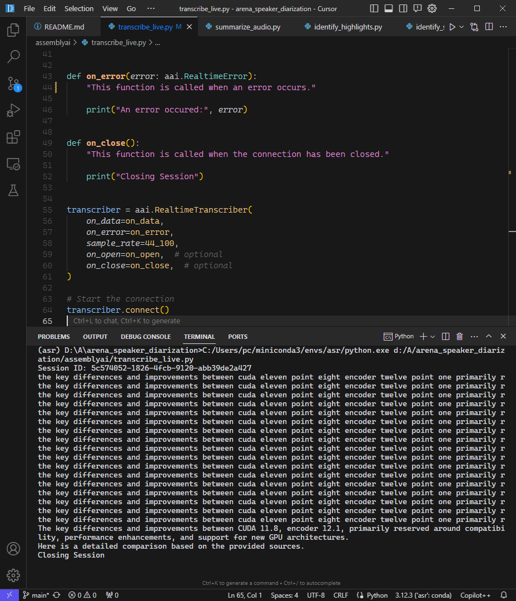

# ⚔ Arena Speaker Diarization 🗣️

This repository compares the performance of various AI models in solving the "Speaker Diarization" task. Speaker Diarization is the process of identifying different speakers in an audio recording and labeling which parts of the audio were spoken by each person.

For example, if you have a recording of a meeting with multiple participants, Speaker Diarization can automatically separate the audio into segments and label each segment with the corresponding speaker's name or ID. This makes transcripts and analysis of multi-speaker recordings much easier to follow.

The goal is to help users choose the best available Speaker Diarization model for their specific use case and requirements.

## AssemblyAI

AssemblyAI is a cloud-based API that allows you to transcribe audio files. It's a good option for small to medium-sized files.

### Getting Started

https://www.assemblyai.com/app/

- [x] [Transcribe your first audio file](./assemblyai/transcribe_audio.py)
- [x] [Identify speakers in your audio](./assemblyai/identify_speakers.py)
- [x] [Identifying highlights in your audio](./assemblyai/identify_highlights.py)
- [x] [Summarize your audio file with an LLM](./assemblyai/summarize_audio.py)
- [x] [Transcribe live audio streams](./assemblyai/transcribe_live.py)

#### Known Issues

🚨 AssemblyAI's live transcription feature seems glitchy.

I said: "The key differences and improvements between CUDA 11.8 and CUDA 12.1 primarily revolve around compatibility, performance enhancements, and support for new GPU architectures. Here's a detailed comparison based on the provided sources"

But it repeated and jumbled my words.

For further information or to share your thoughts, please visit https://twitter.com/BlueBirdBack/status/1785587598293094833.
